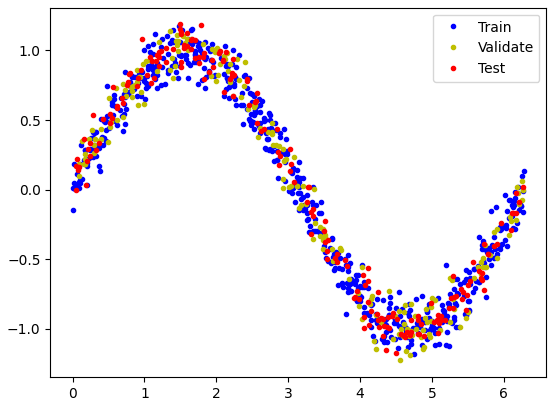
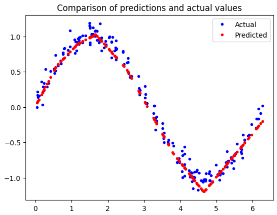
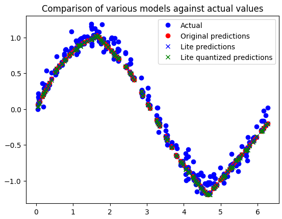

# TinyML Sine Model - Embedded Machine Learning on RP2350


## Overview

This project demonstrates the implementation of a lightweight neural network on the **Raspberry Pi Pico 2 (RP2350)** microcontroller using **TensorFlow Lite Micro**. The model is trained to learn and predict sine wave values, showcasing the feasibility of machine learning on resource-constrained embedded devices.

### Key Features

- 🎯 **Full ML Pipeline**: From training to embedded deployment
- 🚀 **Optimized for Edge**: Runs efficiently on ARM Cortex-M33 (RP2350)
- 📊 **Model Conversion**: TensorFlow → TFLite Micro for embedded inference
- 🔧 **Real-time Inference**: Direct hardware integration with PWM output
- 📈 **Visualization Tools**: Python-based data visualization and model analysis

## Table of Contents

- [Project Structure](#project-structure)
- [Hardware Requirements](#hardware-requirements)
- [Software Requirements](#software-requirements)
- [Training Methodology](#training-methodology)
- [Results](#results)
- [License](#license)

---

## Project Structure

```
tinyML_sine_model/
├── firmware/                          # Embedded C++ implementation
│   ├── CMakeLists.txt                # Build configuration
│   ├── rp2350_tinyML_sine_model.cpp  # Main firmware entry point
│   ├── model.cpp                     # Generated model code
│   ├── model.h                       # Model header file
│   ├── pico_sdk_import.cmake         # Pico SDK configuration
│   ├── plotter.py                    # Visualization utility
│   ├── lib/
│   │   └── tflite_micro/             # TensorFlow Lite Micro library
│   └── build/                        # Build output directory
├── training/                          # Model training
│   └── ml_sine_model.ipynb           # Jupyter notebook with training pipeline
├── README.md                          # This file
├── .gitignore                        # Git ignore rules
├── LICENSE                           # MIT License
```

---

## Hardware Requirements

### Target Platform

| Component | Specification |
|-----------|---------------|
| **Microcontroller** | RP2350 |
| **CPU** | Dual-core ARM Cortex-M33 @ 150 MHz |
| **RAM** | 520 KB on-chip SRAM |
| **Flash** | 4 MB |
| **Peripherals** | PWM, UART, SPI, I2C, ADC |


---

## Software Requirements

### Development Environment

- **CMake** ≥ 3.13
- **Pico SDK** v2.2.0 (or compatible)
- **ARM GCC Toolchain** with Cortex-M33 support
- **Python** 3.8+ (for training and utilities)

### Python Dependencies (Training)

```
tensorflow>=2.12.0
numpy>=1.23.0
matplotlib>=3.5.0
jupyter>=1.0.0
```

### C/C++ Libraries

- **TensorFlow Lite Micro** (included in `firmware/lib/`)
- **Pico Standard Library**
- **CMSIS-NN** (optimizations for neural networks)

---

## Training Methodology

The model training pipeline is provided in a Jupyter notebook for interactive exploration and visualization.

### Approach

The model is trained to approximate the sine function over the range [0, 2π]:

1. **Data Generation**: Generate synthetic sine wave data



2. **Model Architecture**: Dense neural network (1 input, hidden layers, 1 output)
3. **Training**: Optimize using MSE loss function
4. **Conversion**: Export model to TensorFlow Lite format
5. **Quantization**: Model weights quantized to int8 for memory efficiency

### Model Configuration

- **Architecture**: Dense Network (32 → 16 → 8 → 1)
- **Precision**: Full precision (float32) during training, int8 for deployment
- **Expected Size at Deployment**: ~2-4 KB (quantized)

---

## Results

The model successfully approximates the sine function using a lightweight neural network deployable on resource-constrained devices.


### Key Achievements

- **Model trained** to approximate sine wave values over [0, 2π]
- **Quantized to int8** for efficient embedded deployment
- **Compiled for RP2350** with TensorFlow Lite Micro
- **Real-time inference** capable with PWM output integration



---

## License

This project is licensed under the **MIT License** - see the [LICENSE](LICENSE) file for details.
